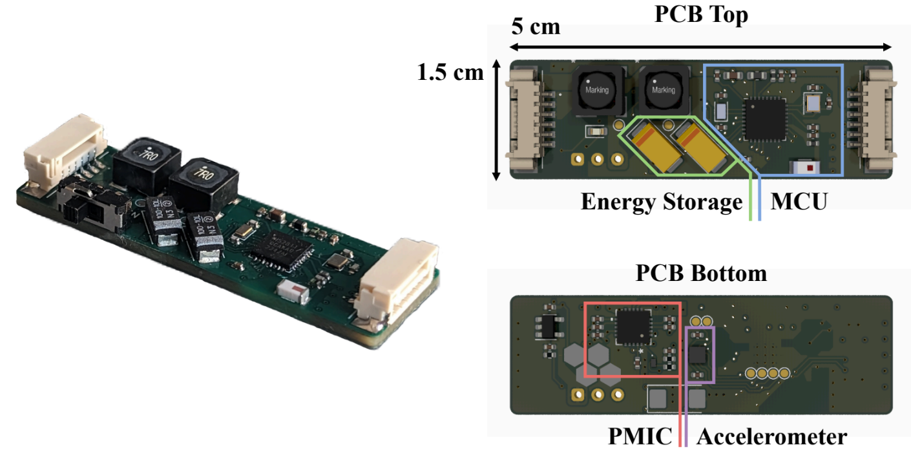

# A Kinetic Energy Harvesting (KEH) sensor for Human Activity Recognition (HAR)
 
Design files for my thesis titled "Design of a Batteryless Sensor for Human Activity Recognition", submitted May 2024 towards an MS in Electrical and Computer Engineering at the University of Texas Austin.

## Electrical Design

A single PCB contains all electrical circuitry required for operation. This can be segmented into two modules, the Power Conversion Module and the Sensing/Communication Module. The Power Module contains the PMIC and energy storage; the Sensing Module contains the MCU and the accelerometer. 

### Power Conversion Module

The Power Module performs a wide array of power regulation-related functions, needed to convert the KEH generator's low and variable peak-to-peak output voltage into a stable, usable VDD for the Sensing Module. The following functions are needed:

1. **Amplification**: Coupled inductors and a transformer driver (similar in topology to an isolated synchronous boost converter) amplify the weak voltage output from the generator into a high peak-to-peak AC signal; this reduces diode voltage losses from rectification.
2. **Rectification**: A full-wave rectifier converts the input AC voltage into DC. This DC voltage must be high enough to step down to the final VDD.
3. **Step-Down Conversion & Regulation**: A switching regulator steps down the unstable DC output from the rectifier to the final VDD.
4. **Charge Management**: A bidirectional gate switches between charging storage capacitors (with excess energy) and discharging storage capacitors.

### Sensing/Communication Module

The Sensing Module contains an SPI-enabled triaxial accelerometer and a BLE MCU. Electrically, the implementation follows their respective datasheets.

### Major Components

| **Component** | **Part Number** |                   **Purpose**                  |
|:-------------:|:---------------:|:----------------------------------------------:|
|      PMIC     |     LTC3109     |       Power rectification and management       |
|    BLE/MCU    |     nRF52811    |        System control, data transmission       |
| Accelerometer |      BMA400     | Triaxial acceleration sampling, data buffering |

The full PCB design (KiCAD schematic + layout files) can be found in `./pcb/*`.
