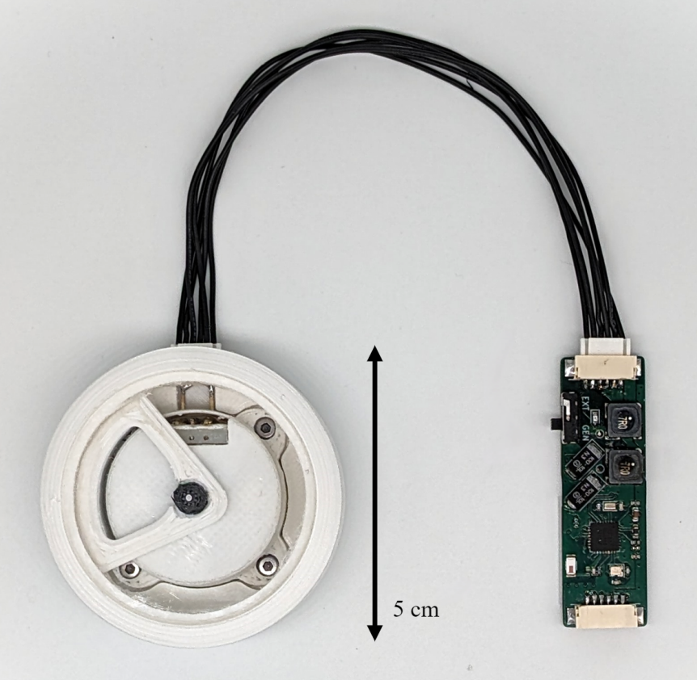
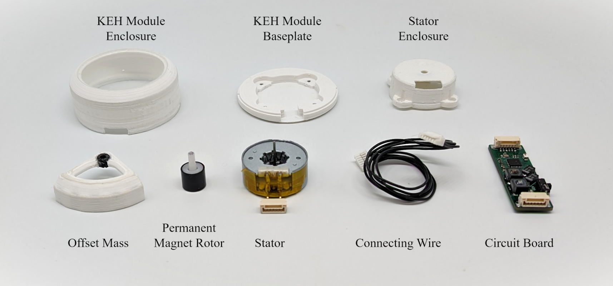
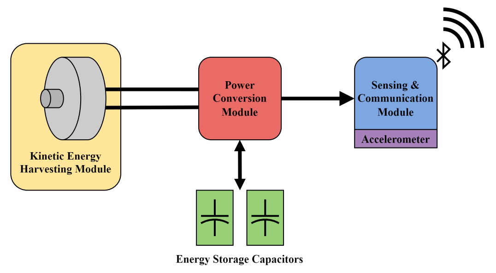
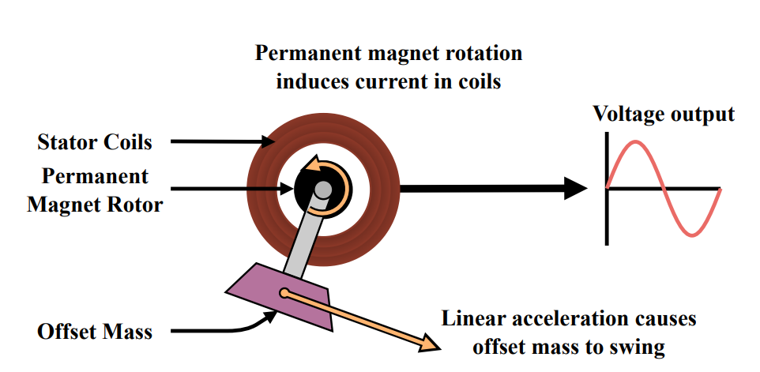
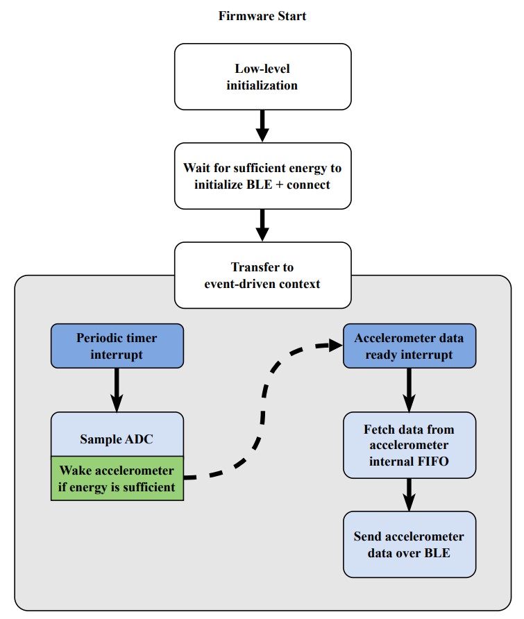
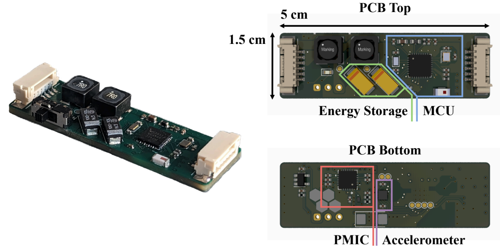

# A Kinetic Energy Harvesting (KEH) sensor for Human Activity Recognition (HAR)
 
Design files for my thesis titled "Design of a Batteryless Sensor for Human Activity Recognition", submitted May 2024 towards an MS in Electrical and Computer Engineering at the University of Texas Austin and advised by Dr. Radu Marculescu.

## Abstract

Recent advancements in sensing technology coupled with the proliferation of
cheap, low power computing have enabled the growing popularity of wearable sensors
in everyday activities. Inertial sensing, particularly for human activity recognition
(HAR), has emerged as a ubiquitous tool across fitness, healthcare, and entertainment
applications. However, conventional wearable sensors rely on batteries, introducing
limitations in cost, environmental impact, and user burden.

This thesis explores a solution to the limitations of battery-powered operation
with the design and implementation of a wearable, kinetic energy harvesting (KEH)
powered wireless inertial sensor for batteryless HAR. The KEH-powered sensor is
energy optimized to require only 140µJ per set of accelerometer samples, translating
to an average power draw of 90µJ during continuous operation. The idle power
consumption is only 9.2µW while connected over Bluetooth. Energy harvesting is
achieved by a rotational unbalanced mass electromagnetic harvester with a peak
power output of 1.3mW.

## Device Summary

#### The full device assembly: The device is designed and assembled entirely from scratch. 

#### Component view of the entire device. Enclosures are located on the top row. There are four functional components, split between the Kinetic Energy Harvesting (KEH) Module (offset mass, rotor, stator), and the Power Conversion and Sensing/Communication Modules (PCB).

#### Full device block diagram. Energy harvested by the KEH Module (left) is converted to usable power by the Power Module (middle), which is used to sample an accelerometer and to transmit data by the Sensing Module (right). Energy storage capacitors buffer the usable power.

## Physical Design

*Files are located in `./3d/*`*

The physical operation the device centers around the KEH Module, custom-designed to address the relatively high power requirements and tight space constraints of the wearable KEH sensor. The KEH Module is a rotational unbalanced mass EM harvester; this type of harvester is implemented using a statically-mounted stator and a rotor containing a permanent magnet and an attached offset mass. 

The KEH Module and its enclosure are primarily comprised of 3D-printed polylactic acid (PLA) thermoplastic. The top of the KEH Module is a 3mm acrylic panel, stiffening the assembly and providing stability to the top of the rotor. The stator and rotor are retrieved from a 28BYJ-48 geared unipolar stepper motor. For this application, the gears are removed and the stator is modified to be bipolar. The offset mass is also constructed from PLA, with steel M3 screws and fasteners for added weight. The mass totals 8.7g with a radius of 20mm.

## Firmware Design

*Files are located in `./firmware/*`*

The firmware architecture of device adheres to an event-driven paradigm, with a target of minimizing processor occupancy. By transferring execution context between various hardware-driven interrupt handlers, the total amount of processing time can be reduced. 

Initialization must be separated into a low-level initialization and BLE initialization
due to the significant power requirements of BLE: BLE initialization includes connecting to a listening device, which has an energy budget orders of magnitude higher than low-level initialization. 

After initialization is completed (including completing a BLE connection),
context is fully transferred to a series of hardware-driven interrupts. In steady-state
operation, all system execution is triggered by a periodic timer interrupt running every
100ms. The interrupt handler initiates ADC sampling; upon completion of the ADC
sample a subsequent hardware interrupt is triggered, executing energy-monitoring
logic. If energy is sufficient for the accelerometer to sample a set of data and for a
BLE packet to be sent, the accelerometer is woken up. Running independently of the
MCU, the accelerometer stores 16 samples of data within an internal first-in-first-out
buffer (FIFO). The filling of this FIFO then triggers a hardware interrupt in the
MCU, signaling the MCU to retrieve the FIFO data and to transmit the data over
BLE.

## Electrical Design

*Files are located in `./pcb/*`*

A single PCB contains all electrical circuitry required for operation. This can be segmented into two modules, the Power Conversion Module and the Sensing/Communication Module. The Power Module contains the PMIC and energy storage; the Sensing Module contains the MCU and the accelerometer. 

### Power Conversion Module

The Power Module performs a wide array of power regulation-related functions, needed to convert the KEH generator's low and variable peak-to-peak output voltage into a stable, usable VDD for the Sensing Module. The following functions are included:

1. **Amplification**: Coupled inductors and a transformer driver (similar in topology to an isolated synchronous boost converter) amplify the weak voltage output from the generator into a high peak-to-peak AC signal; this reduces diode voltage losses from rectification.
2. **Rectification**: A full-wave rectifier converts the input AC voltage into DC. This DC voltage must be high enough to step down to the final VDD.
3. **Step-Down Conversion & Regulation**: A switching regulator steps down the unstable DC output from the rectifier to the final VDD.
4. **Charge Management**: A bidirectional gate switches between charging storage capacitors (with excess energy) and discharging storage capacitors.

### Sensing/Communication Module

The Sensing Module contains an SPI-enabled triaxial accelerometer and a BLE MCU. Electrically, the implementation follows their respective datasheets.

### Major Components

| **Component** | **Part Number** |                   **Purpose**                  |
|:-------------:|:---------------:|:----------------------------------------------:|
|      PMIC     |     LTC3109     |       Power rectification and management       |
|    BLE/MCU    |     nRF52811    |        System control, data transmission       |
| Accelerometer |      BMA400     | Triaxial acceleration sampling, data buffering |

## Power Performance

### Power Generation

| **Measurement** | **Value** |
|:---------------:|:---------:|
|   Peak Voltage  |   350 mV  |
|   Peak Current  |    4 mA   |
|    Peak Power   |   1.3 mW  |

### Power Consumption

|         **Event**        | **Value** |
|:------------------------:|:---------:|
|          Inrush          |   23 µJ   |
|  Hardware Initialization |   48 µJ   |
|    BLE Initialization    |   620 µJ  |
|        ADC Sample        |  0.88 µJ  |
| Accelerometer & BLE Send |   102 µJ  |
|   Leakage (Device Idle)  |   9.2 µW  |
|  Leakage (Open Circuit)  |    6 µW   |

## File Structure

| **Folder** | **Description**                          | **Tool/Toolchain** |
|------------|------------------------------------------|--------------------|
| ./firmware | Device firmware and project files        | SEGGER 5.42a       |
| ./pcb      | PCB schematic, layout, and project files | KiCAD 7.0          |
| ./3d       | CAD files for generator and enclosures   | SOLIDWORKS 2022    |
